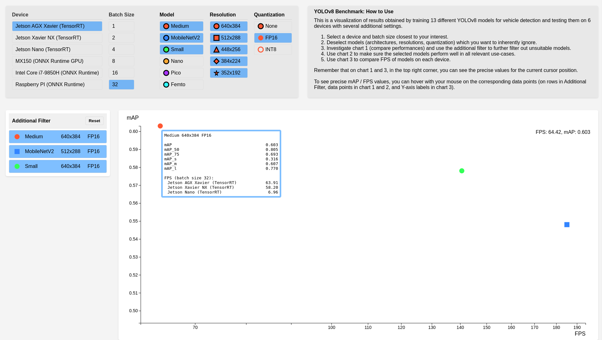
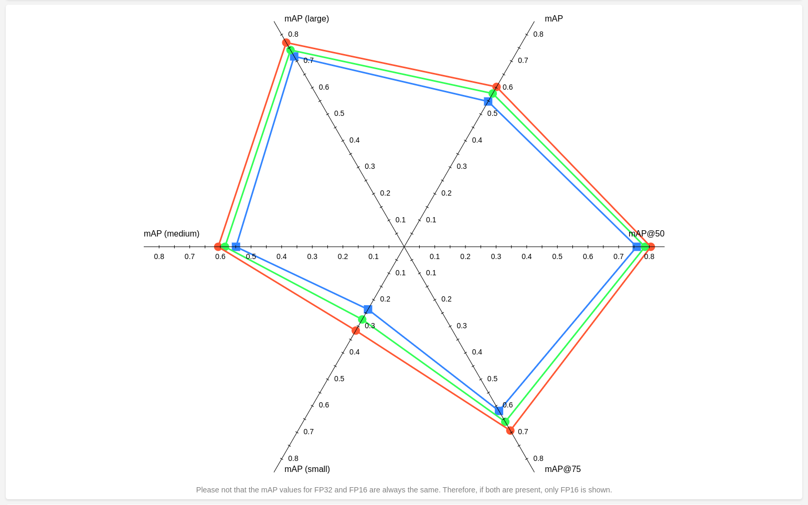
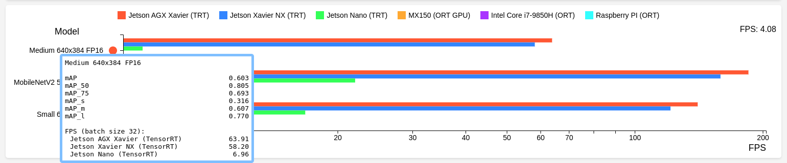

---
header-includes:
  - \usepackage{geometry}
  - \geometry{margin=1in}
---

# OBJECT DETECTION BENCHMARK

This tool visualizes the performance statistics of 13 YOLOv8 models (6 architectures and 6 input resolutions) trained for vehicle detection. Tests were conducted on 6 devices with 6 different batch sizes from 1 to 32 and quantizations to FP16 and INT8 were included. It should help when choosing the right architecture, input resolution and device for any vehicle detection task.

This file will contain some information about the underlying data and how they were obtained, but for more, see the original repository [https://github.com/sktedro/vehicle_detection_for_embedded_platforms](https://github.com/sktedro/vehicle_detection_for_embedded_platforms)

Built using the D3 JavaScript library [https://d3js.org/](https://d3js.org/)


# Data Format

All collected data are present in a single JSON file of format:
```
data = {
    "device": { # Eg. "nano", "agx", "rpi", ...
        "model": { # Eg. "yolov8_f"
            "input_shape": { # Eg. "352x192"
                "backend": { # "tensorrt" or "onnxruntime"
                    "quantization": { # "none", "fp16", "int8"
                        "model_shape": { # "dynamic" or "static"
                            "batch_size": { # Eg. "1", "8", "32"...
                                "bbox_mAP": "float number in a string",
                                "bbox_mAP_50": "float number in a string",
                                "bbox_mAP_75": "float number in a string",
                                "bbox_mAP_s": "float number in a string",
                                "bbox_mAP_m": "float number in a string",
                                "bbox_mAP_l": "float number in a string",
                                "fps": "float number in a strin"g
                            }}}}}}}}
```

Note that not all expected data are present! For example, on the NVIDIA MX150 device, the YOLOv8 Medium could not be tested with batch sizes 16 and 32, because the model did not fit into the memory. However, it's safe to say that mAP values don't depend on the device and in this case, the FPS values would be equal to ones with batch size of 8, so values like these can (and are) substituted.


# A few words about the design choices

### Two-stage filtering

The average user can quickly filter out many models by a property, for example based on their size (eg. the user only wants precise - larger models). However, filtering models individually is necessary too, to hide ones that are not viable.

### Chart 1

In the first chart, we want to compare the models across as many variables as possible. Most important are, of course, the architecture (size), the input resolution and the quantization. Additionally, we'd like to compare the models in terms of speed (FPS) and precision (mAP) at the same time. For that, a simple scatter plot with each of the 39 data points having a unique visual seems like the best choice.

### Chart 2

Because we only expect a handful of models to make it to the second chart and we have 6 axes to show (6 different mAP metrics), the spider chart seems like the best choice. Parallel coordinates could work too, but they are worse at displaying the differences between individual data points.

### Chart 3

In the third chart, we want the user to be able to compare the speeds at which models perform on the benchmarked devices. Again, we only expect a handful models to make it here.

For each model, the user should be able to compare its speed measured on all devices, but also compare individual. We think the best solution is to have a bar for each device, for each model, although not perfectly intuitive.

### Data Precision

We expect the user to need the exact values of each data point. Therefore, in chart 1 and 3, there is a tooltip in the top right corner showing the exact values for the position of the cursor. Additionally, hovering the mouse on a data point in chart 1 and chart 2, or on Y axis tick label of chart 3, or on a row in the Additional Filter section, shows a tooltip including the exact values for the model (model specification, mAP metrics and FPS for each available device).


# Demo

An example user comparing three largest models of FP16 quantization could get these results (note that in the first and third chart, the cursor is aimed to show the tooltip including model's stats):






# Lessons learned

- The importance of interactivity - we can't even imagine how a user would try to draw the necessary conclusions if this visualization was not interactive. The filters are a must-have.
- There are countless ways to visualize a single thing and often, there are more than one correct ones.
- Simple-to-use vs. comprehensive-and-precise: as much as we wanted to make the visualization simple and intuitive, adding features and showing as much data as possible made the visualization less intuitive. Taking the time to rework the visualization with the new requirements helped a bit, but not enough, indicating that these two approaches go against each other.
- Half the time spent on the project was tinkering with the styles so the app doesn't look like it's created by a blind person. We expected that to be easier.
- A visualization might look good on paper and also be totally bad when implemented because on paper, the sketch is simplified.
- It's hard to read from a logarithmic axis but sometimes there doesn't seem to be an alternative.